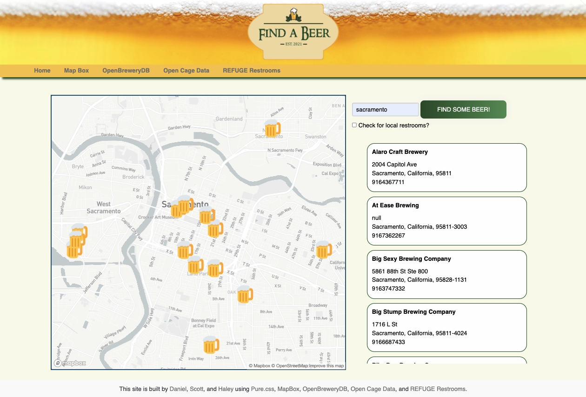

# Find A Beer

## Description
- A web application which helps you find a beer !
- Search a city and get the location of local breweries !
- You can also see restrooms in the area if you find you gotta go !

### Installation
- The project is uploaded to [GitHub](https://github.com/) at the following repository: [here](https://github.com/sourslaw/Project_One)
- Deployed application may be seen: [here](https://sourslaw.github.io/Project_One/)

### Usage

- Entering the name of a US city, the user is presented with the local breweries on the map
	- Information cards are also populated under the search area
	- Clicking on a brewery's information card will zoom to that location
- The location of restrooms can also be toggled on and off
- Clicking on either a brewery location or a restroom location, the user is presented with relevant information

### Credits
- [Open Brewery DB](https://www.openbrewerydb.org/)
- [OpenCage Geocoding API](https://opencagedata.com/api)
- [Pure.css](https://purecss.io/)
- [Refuge Restrooms](https://www.refugerestrooms.org/api/docs/)

### Contributors
- [Daniel Mosso](https://github.com/benjimosso)
- [Haley Parish](https://github.com/heparish)

### License
- Licensed under the [MIT](https://opensource.org/licenses/mit-license.php) license.
